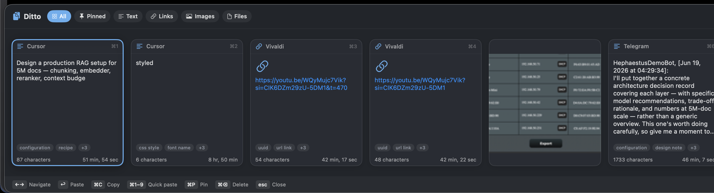
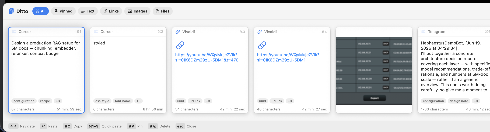
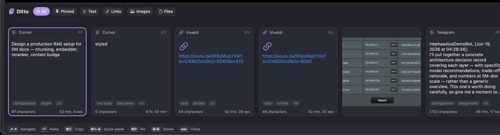
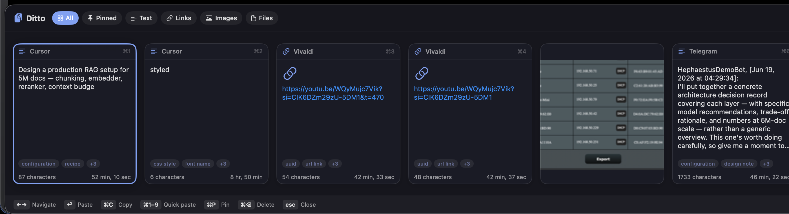

<h1 align="center">Yank</h1>

<p align="center"><b>Copy anything. Yank it back.</b><br>
A fast, private, open-source clipboard manager for macOS — searchable by <i>meaning</i>, entirely on your Mac.</p>

<p align="center">
  
  
  
  
  
</p>

<p align="center"></p>

Press **⌃⌥⌘V** anywhere and your clipboard history slides up from the bottom of the
screen as a strip of cards. Pick one and it pastes straight back into whatever app
you were in. Named after Vim's word for *copy* — `yank`.

Built with Swift, AppKit and SwiftUI. **No Electron, no telemetry, no account, no
cloud.** Everything you copy stays on your Mac.

## Why Yank

- **🔎 Smart search, on-device.** The default **Smart** mode shows your exact matches
  first, then the semantically closest clips — find "that database query" by meaning
  *and* still get the literal token you typed. Switch modes (Smart / Exact / Tag)
  right from the pill next to the search field. No network, no account.
- **🔒 Private, and provably so.** Nothing ever leaves your Mac. Clipboard content is
  **encrypted at rest** with a key bound to the **Secure Enclave** (where available),
  password managers are skipped, and being open source you can read the source and
  confirm there are zero network calls. ([Why no sync →](PRIVACY.md))
- **🎨 17 themes, 3 layouts.** A clean Swiss greyscale, One Dark, Dracula, Tokyo Night,
  Catppuccin and more — follows your macOS Light/Dark appearance. Card strip, compact
  list, or a Spotlight-style palette with live preview.
- **⌨️ Keyboard-first.** Summon, search, navigate, and paste without leaving the home row.
- **🧱 Everything you copy.** Text, rich text, links, hex colors, files and images — each
  detected automatically with type-appropriate previews and thumbnails.

<p align="center">
  
  <br>
  
  
</p>

## Keyboard shortcuts

| Shortcut | Action |
| --- | --- |
| `⌃⌥⌘V` | Show / hide the Yank bar |
| `← →` / `↑ ↓` | Move selection |
| `↩` | Paste selected clip |
| `⌘C` / `⌃C` | Copy selected clip (no paste) |
| `⌥↩` | Paste selected clip as plain text |
| `⌘1`–`⌘9` | Quick-paste by position |
| `⌘P` | Pin / unpin selection |
| `⌘⌫` | Delete selection |
| `esc` | Dismiss (or close settings) |

Click a card to select it; click again to paste. The toolbar **gear** opens settings
right inside the bar (theme, layout, search mode, sound, history limit, permissions).

## Install

Download the latest DMG from [**Releases**](https://github.com/AntreasAntoniou/yank/releases/latest),
drag **Yank** to Applications, and press **⌃⌥⌘V**. Or build from source (below).

On first launch macOS asks for **Accessibility** access — Yank needs it to send the
⌘V keystroke that pastes into the focused app (*System Settings → Privacy & Security →
Accessibility*). Until granted, selecting a clip still copies it; you paste manually.

## Build from source

Requires macOS 13+ and the Swift toolchain (Xcode 15+).

```bash
git clone https://github.com/AntreasAntoniou/yank.git
cd yank
make run          # builds Yank.app and launches it
```

Other targets: `make app` (build `build/Yank.app`) · `make install` (copy to /Applications) · `make build` (debug binary) · `make clean`.

## Privacy

Everything is stored **locally** and **encrypted at rest**; Yank makes no network
requests and has no telemetry, analytics, or account. Password managers (transient /
concealed / auto-generated pasteboards) are skipped, and you can exclude any app. See
[PRIVACY.md](PRIVACY.md) — including **why there is, and will be, no cloud sync**.

## Deep search (on-device embeddings)

Beyond exact substring, Yank searches **semantically**, fully on-device:

- **Smart search (default)** — exact substring matches first, then the semantically
  closest remaining clips (full vector cosine). You always get the obvious hit, plus
  meaning-based suggestions below it.
- **Exact** — literal case-insensitive substring only.
- **Tag search** — every clip is classified at ingest into its top-5 of **100 preset
  tags**; a query maps to its nearest tag then an O(1) inverted-index lookup.

Models run locally via **CoreML**:

| Tier | Model | Dim |
| --- | --- | --- |
| Low | [`axiotic/ogma-micro`](https://huggingface.co/axiotic/ogma-micro) | 128 |
| Normal (default) | [`axiotic/ogma-small`](https://huggingface.co/axiotic/ogma-small) | 256 |

The tag taxonomy is configurable in **Settings → Tags** (curated baskets or your own).
Token ids and embeddings match the PyTorch reference exactly (the tokenizer is
reimplemented in Swift). To produce/bundle the models, see [`tools/`](tools/README.md).

## How it works

| Piece | File |
| --- | --- |
| Pasteboard polling + type detection | `Sources/Yank/Clipboard/ClipboardMonitor.swift` |
| History model, dedup, incremental index, trimming | `Sources/Yank/Clipboard/ClipStore.swift` |
| Encrypted SQLite store (Float16 vector BLOBs, WAL) | `Sources/Yank/Clipboard/Database.swift`, `Crypto.swift` |
| Global hotkey (Carbon) + slide-up panel | `Sources/Yank/App/HotKey.swift`, `UI/FloatingPanel.swift` |
| Bar, cards, themes, layouts (SwiftUI) | `Sources/Yank/UI/ContentView.swift`, `ClipCardView.swift`, `Theme.swift` |

## Roadmap

- **Clip stack** — queue several, paste in order
- **On-device OCR** — search text inside image clips
- Customizable hotkey · smart actions on links & colors

## License

MIT © Axiotic. Bundled on-device models have their own licenses — see
[THIRD-PARTY-NOTICES.md](THIRD-PARTY-NOTICES.md).
